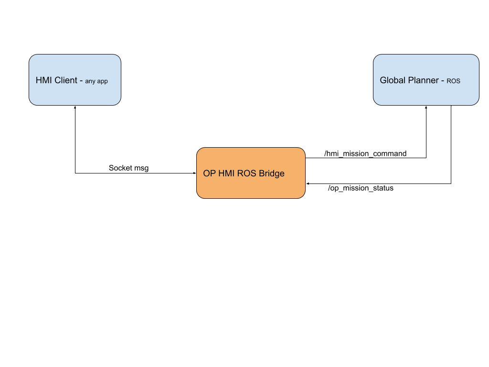

# OpenPlanner - Utilities

## op_bag_player

OpeGL based rosbag file player, it enable frame by frame playing, but only supports 3 types of topics (lidar data point cloud, current pose, image)

### Outputs
publish topics for points_raw, ndt_pose, and image_raw


### Options
 * play data forward (space)
 * pause (space)
 * step forward by one frame (up button)
 * step backwards by one frame (down button)
 * exit (Esc button) 


### Requirements

1. rosbag path with /pose, /lidar and /image topics recorded 

### How to launch

* From a sourced terminal:

`roslaunch op_utilities op_bag_player.launch`

* From Runtime Manager:

Computing Tab -> Motion Planning -> OpenPlanner - Utilities  -> op_bag_player


### Parameters 
 * rosbag file path 

### Subscriptions/Publications

```
Publications: 
 * /points_raw [sensor_msgs::PointCloud2]
 * /ndt_pose [geometry_msgs::PoseStamped]
 * /image_raw [sensor_msgs::Image]

Subscriptions: 
 
```

## op_pose2tf

This node recieve ndt_pose and publish current pose TF to the autoware system. so we don't need to run ndt_matching again. 

### Outputs
pose TF

### Requirements

1. ndt_pose topic is published 

### How to launch

* From a sourced terminal:

`roslaunch op_utilities op_pose2tf.launch`

* From Runtime Manager:

Computing Tab -> Motion Planning -> OpenPlanner - Utilities  -> op_pose2tf


### Parameters 
 * ndt_pose topic name


## op_hmi_bridge 
This node connects between global planning (op_global_plannet) state machine and a socket based HMI clinet. 
check the socket client code and [readme](https://gitlab.com/hatem-darweesh-autoware.ai/op_hmi_socket_client/-/tree/master)

### op_hmi_brige topic connections 


