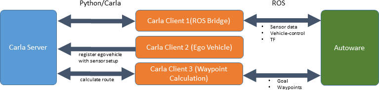

# Autoware-CARLA
This repository is installation guide for integrates Autoware with CARLA

**Reference**

- Autoware version is 1.15 + openplanner2.5 by Hatem-darweesh 
https://github.com/hatem-darweesh/autoware.ai.openplanner
- CARLA-Autoware bridge by carla-simulator
https://github.com/carla-simulator/carla-autoware


## Docker and NVIDIA-container-runtime Installation for run Autoware 1.15 docker image

**If you have already installed docker and nvidia-container-runtime, this process is not necessary**

*Docker Installation*
```
$ sudo apt update
$ sudo apt-get install apt-transport-https ca-certificates curl gnupg lsb-release
$ curl -fsSL https://download.docker.com/linux/ubuntu/gpg | sudo gpg --dearmor -o /usr/share/keyrings/docker-archive-keyring.gpg
$ echo \
  "deb [arch=$(dpkg --print-architecture) signed-by=/usr/share/keyrings/docker-archive-keyring.gpg] https://download.docker.com/linux/ubuntu \
  $(lsb_release -cs) stable" | sudo tee /etc/apt/sources.list.d/docker.list > /dev/null
$ sudo apt update
$ sudo apt-get install docker-ce docker-ce-cli containerd.io
```
if above process is unavailable, try docker official installation reference
https://docs.docker.com/engine/install/ubuntu/


*nvidia-container-runtime Installation*

```
$ curl -s -L https://nvidia.github.io/nvidia-container-runtime/gpgkey | \
  sudo apt-key add - distribution=$(. /etc/os-release;echo $ID$VERSION_ID)
$ curl -s -L https://nvidia.github.io/nvidia-container-runtime/$distribution/nvidia-container-runtime.list | sudo tee /etc/apt/sources.list.d/nvidia-container-runtime.list
$ sudo apt-get update
$ sudo apt-get install nvidia-container-runtime
```

if above process is unavailable, try nvidia-container-runtime official installation reference
https://github.com/NVIDIA/nvidia-container-runtime

## Download CARLA Simulator and CARLA Contents
### CARLA simulator
**Download CARLA simulator**
 [CARLA_0.9.10.1.tar.gz](https://carla-releases.s3.eu-west-3.amazonaws.com/Linux/CARLA_0.9.10.1.tar.gz)
- CARLA official download page, for more information, read https://github.com/carla-simulator/carla
```
$ mkdir $HOME/shared_dir
$ cd $HOME/shared_dir
$ tar xfvz <CARLA_0.9.10.1.tar.gz PATH>
$ mv <your_CARLA_directory> CARLA
**make sure that untar CARLA_0.9.10.1.tar.gz in shared_dir directory**
```
### CARLA contents(Map, Config ...)
**Install git lfs(Large File System)**
```
$ curl -s https://packagecloud.io/install/repositories/github/git-lfs/script.deb.sh | sudo bash
$ sudo apt-get install git-lfs
```
**Get the contents from git**
```
$ cd $HOME/shared_dir
$ mkdir data
$ git lfs clone https://github.com/carla-simulator/carla-autoware.git
$ cd carla-autoware
$ git submodule update --init
$ mv autoware-contents carla
$ mv carla $HOME/shared_dir/data
** make sure that map files in $HOME/shared_dir/data/carla/maps and config files in $HOME/shared_dir/data/carla/configs**
```
## Pull Autoware Bleedingedge Image From DockerHub
```
$ sudo docker pull autoware/autoware:bleedingedge-melodic-base-cuda
```
## Run Autoware 1.15 Docker Container using Custom Script
```
$ cd $HOME/shared_dir
$ git clone https://github.com/sethut1224/Autoware-CARLA
$ cd Autoware-CARLA
$ sudo ./run_autoware_docker_container.sh bleedingedge-melodic-base-cuda
> usage : ./run_autoware_docker_container.sh <IMAGE_TAG>
```
***now, you will be inside the container!***

## Container Setting 
```
$ cp -arp shared_dir/Autoware-CARLA/Autoware $HOME
$ ./install_dependencies.sh
$ ./setting.sh
```
## Build Autoware packages
you can use build alias **cc, ccu, cuda_ccu**
* **$ cc <package_name>**:   colcon build --packages-select <package_name>
* **$ ccu <package_name>**: colcon build --packages-up-to <package_name>
* **$ cu** : AUTOWARE_COMPILE_WITH_CUDA=1 colcon build --cmake-args -DCMAKE_BUILD_TYPE=Release --packages-up-to
* **$ cu <package_name>** :  AUTOWARE_COMPILE_WITH_CUDA=1 colcon build --cmake-args -DCMAKE_BUILD_TYPE=Release --packages-up-to <package_name>


## Autoware-CARLA Design

The bridge contains three Carla Clients.

1. ROS Bridge - Monitors existing actors in Carla, publishes changes on ROS Topics (e.g. new sensor data)
2. Ego Vehicle - Instantiation of the ego vehicle with its sensor setup.
3. Waypoint Calculation - Uses the Carla Python API to calculate a route.



## Scenario Execution

It is possible to use CARLA scenario runner in conjunction with autoware: [Documentation](docs/use_scenario_runner.md).


## Run CARLA-Autoware
**Run CARLA Simulator**
* $cd $HOME/shared_dir/CARLA
* $./CarlaUE4._sh -opengl

**Run CARLA Autoware Agent**
* $roslaunch autoware_carla_agent autoware_carla_agent.launch
